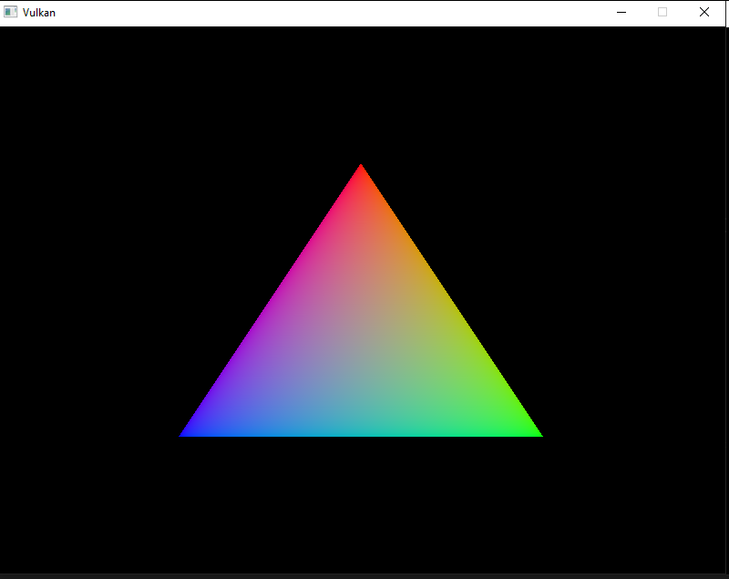

# Rectangle in Vulkan

Render of rectangle using VulkanSDK, GLM(https://github.com/g-truc/glm) and GLFW(https://github.com/glfw/glfw).

  - Render of the most wonderful RGB rectangle in the world.
  - Debug using Validation Layers (https://github.com/KhronosGroup/Vulkan-ValidationLayers).
  - Creation of rectangle was sponcored by 60 points gang.
 
 Shaders was created using glslc.exe in VulkanSDK and it translated code into .spv files, that used in the program.
